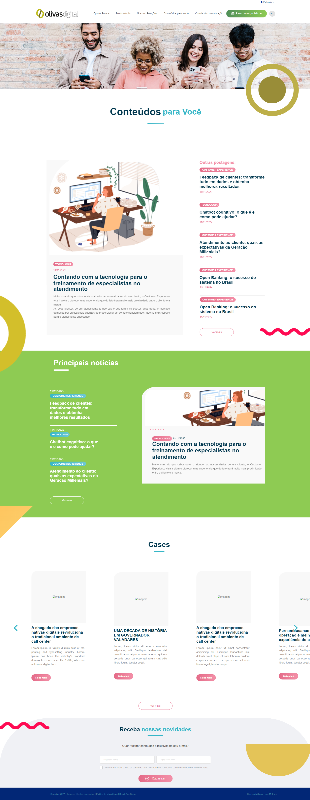

<table align="left">
    <tr>
        <td>
                <a href="README.md"> 🇧🇷 Português </a>
        </td>
        <td>
            <b>
                <a href="readme-us.md"> 🇺🇸 English </a>
            </b>
        </td>
    </tr>

</table>

   

# Test - Landing Page Olivas

## ⚡ About

The project consists of carrying out the clone project of the static corporate landing page of Olivas Digital.

## 🛸 Technologies Used

- HTML 5
- CSS 3
- JAVA SCRIPT

## 💻 Demonstration

